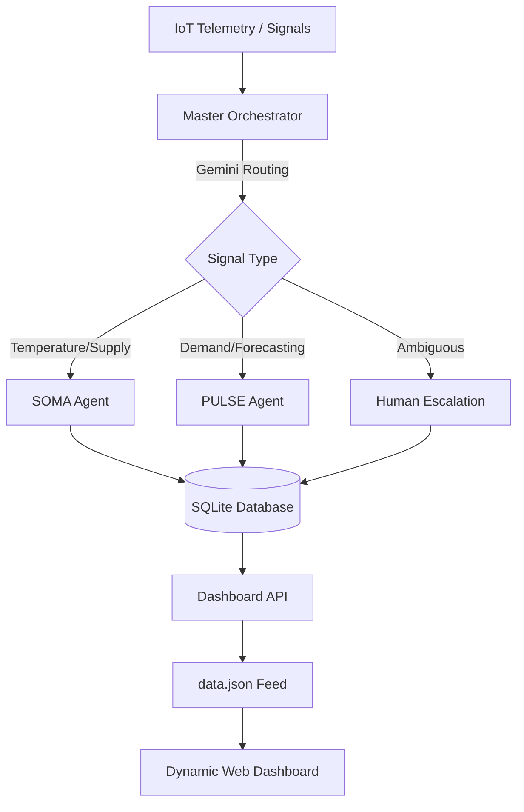

# PharmaIQ: Intelligent Pharmacy Operations Dashboard

PharmaIQ is an AI-driven terminal and web-based orchestrator designed to manage large-scale pharmacy operations. It uses Gemini-powered agents to route operational signals (IoT telemetry, demand spikes, temperature alerts) to specialized handlers, providing real-time visibility through a dynamic, multi-tab dashboard.

## 🏛 Architecture

PharmaIQ follows a modular agentic architecture centered around a **Master Orchestrator**.



### Core Components:
- **Master Orchestrator**: Uses Gemini to analyze natural language or structured JSON signals and route them to specific agents.
- **SOMA (Supply & Ops Management Agent)**: Handles inventory, cold-chain breaches, and supply chain logistics.
- **PULSE (Predictive Uplift & Logistics Analytics)**: Generates demand forecasts and alerts for stock-outs or surges.
- **Dynamic Dashboard**: A Vanilla JS/CSS frontend that auto-refreshes every 5 seconds using a local JSON feed.

## 🚀 Getting Started

### 1. Setup Environment
Ensure you have a `.env` file with your Gemini API Key:
```env
GOOGLE_API_KEY=your_api_key_here
```

### 2. Run the Live Simulation
To see the system in action, start the continuous simulation:
```bash
python3 simulation/live_mode.py
```

### 3. Launch the Dashboard
Start the local server and open the UI:
```bash
python3 frontend/server.py
```
View the dashboard at: **[http://localhost:8080/dashboard.html](http://localhost:8080/dashboard.html)**

## 📊 Features
- **Live Store Health**: Real-time status grid for all 10 monitored stores.
- **System Activity Log**: Historical record of every AI routing decision and agent action.
- **Inventory Risk Analytics**: Dedicated tracking for quarantined or compromised medication.
- **Fleet Monitoring**: Zone-based delivery tracking (simulated).

## 🛠 Tech Stack
- **Backend**: Python, LangGraph, SQLite
- **AI**: Google Gemini (via `google.generativeai`)
- **Frontend**: HTML5, Vanilla CSS3, Javascript (Dynamic Polling)
- **Infrastructure**: MCP (Model Context Protocol) Servers
