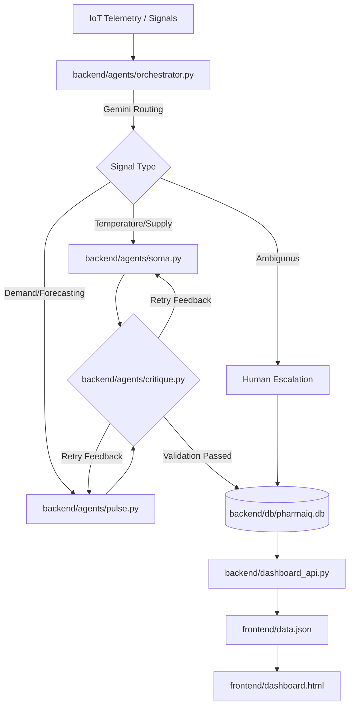

# PharmaIQ: Intelligent Pharmacy Operations Dashboard

PharmaIQ is an AI-driven terminal and web-based orchestrator designed to manage large-scale pharmacy operations. It uses Gemini-powered agents to route operational signals (IoT telemetry, demand spikes, temperature alerts) to specialized handlers, providing real-time visibility through a dynamic, multi-tab dashboard.

## 🏛 Architecture

PharmaIQ follows a modular agentic architecture centered around a **Master Orchestrator**.



### Core Components:
- **`backend/agents/orchestrator.py`**: Intelligent router using Gemini to dispatch signals.
- **`backend/agents/critique.py`**: **[NEW]** Automated review layer that validates and refines AI actions.
- **`backend/agents/[soma/pulse].py`**: Specialized handlers for logistics and predictive demand.
- **`backend/simulation`**: Real-time IoT and market signal generation engine.
- **`backend/db`**: Persistence layer for alerts, state, and audit logs.
- **`frontend/`**: Vanilla JS/CSS dashboard and local web server.

## 🚀 Getting Started

### 1. Setup Environment
Ensure you have a `.env` file with your Gemini API Key:
```env
GOOGLE_API_KEY=your_api_key_here
```

### 2. Run the Live Simulation
To see the system in action, start the continuous simulation:
```bash
python3 simulation/live_mode.py
```

### 3. Launch the Dashboard
Start the local server and open the UI:
```bash
python3 frontend/server.py
```
View the dashboard at: **[http://localhost:8080/dashboard.html](http://localhost:8080/dashboard.html)**

## 📊 Features
- **Critique Agent Loop**: An automated quality control loop that reviews and refines agent actions (SOMA/PULSE) before they reach the dashboard.
- **Manual Resolution**: A dedicated **Escalation Queue** allows human operators to review and resolve complex operational signals directly from the UI.
- **State-Driven Store Health**: Dynamic store cards that transition between **Escalated**, **Critical**, **Warning**, and **Stable** based on live signal severity.
- **Auto-Resolution**: System self-heals by automatically resolving previous alerts when sensor telemetry returns to safe ranges.
- **Live Demand Forecasting**: Dynamic, bar-charted forecasts generated by the **PULSE** agent for major regional hubs.
- **Inventory Risk Analytics**: Dedicated tracking for quarantined or compromised medication.

## 🛠 Tech Stack
- **Backend**: Python, LangGraph, SQLite
- **AI**: Google Gemini (via `google.generativeai`)
- **Frontend**: HTML5, Vanilla CSS3, Javascript (Dynamic Polling)
- **Infrastructure**: MCP (Model Context Protocol) Servers
